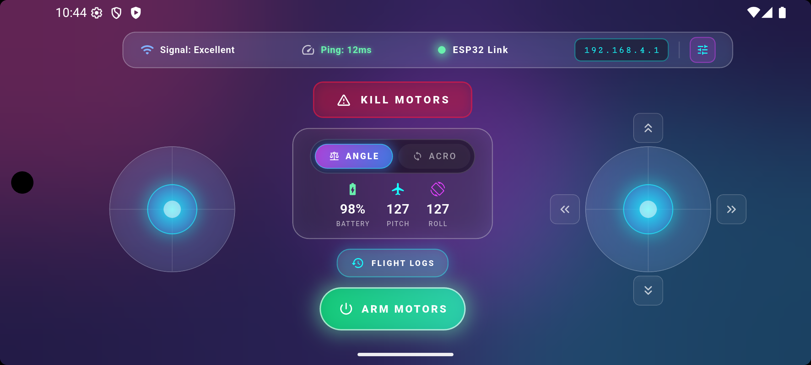
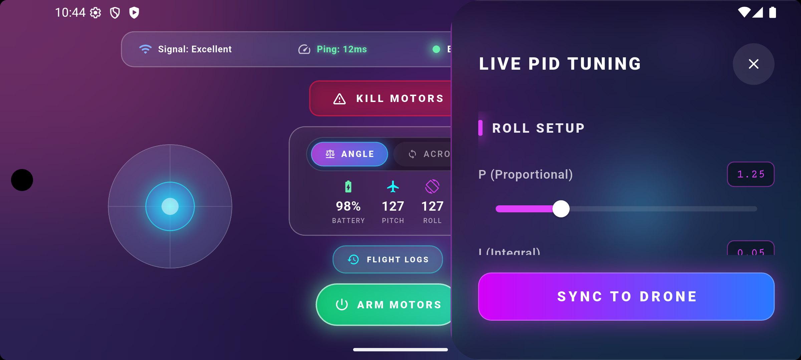
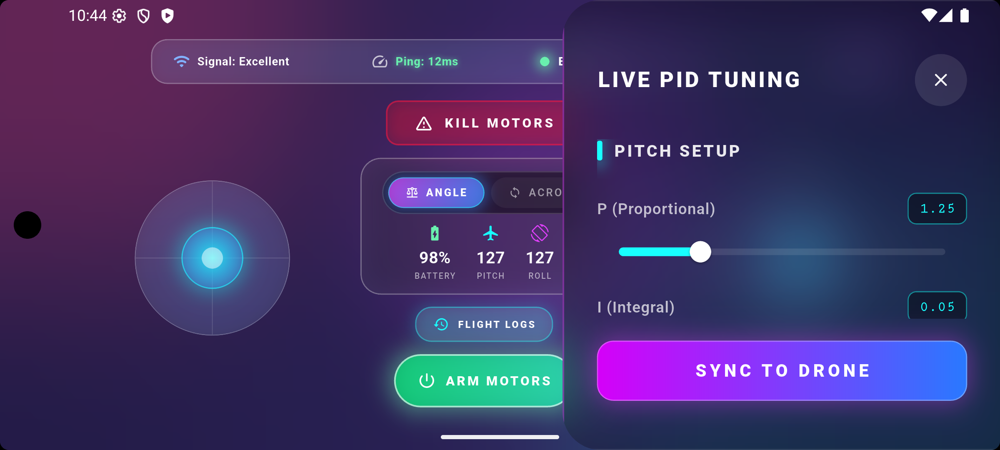
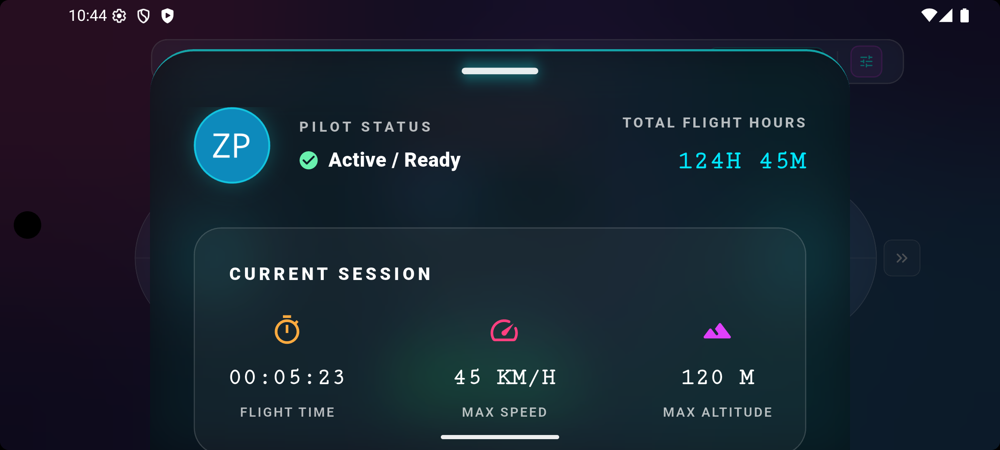
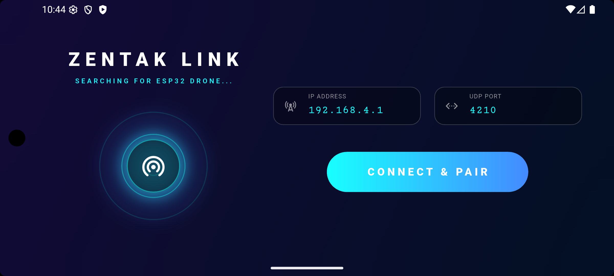

# Zentak Aero 🛸


A high-performance, ultra-premium mobile drone controller application designed for **ESP32-based Wi-Fi Drones**. Built entirely with Flutter, it features a custom-engineered **"Zentak Glass UI"** aesthetic, delivering a cinematic, glassmorphic experience while maintaining a strict 60fps real-time control loop.

---

## 📸 Interface Gallery

Here are the core interfaces of Zentak Aero:

### 1. Main Flight Dashboard
The primary flight control interface featuring dual virtual joysticks, real-time telemetry, and quick-access trim controls.


### 2. Live PID Tuning (Roll & Pitch)
A deeply integrated slide-out drawer allowing real-time Proportional, Integral, and Derivative (PID) tuning transmitted via UDP.



### 3. Flight Logs & Pilot Profile
A sleek, draggable frosted-glass bottom sheet that displays current session metrics and historical flight data.


### 4. Drone Pairing & Connection (New!)
The initial launch interface featuring an animated radar, glowing deep-space gradients, and modular UDP connection settings.


---

## ✨ Key Features

*   **Zentak Glass UI System**: A custom design language using `BackdropFilter`, complex multi-layered blur effects, and glowing gradients.
*   **Dual Joystick Engine**: Custom-painted, highly responsive virtual joysticks tailored for precise Throttle, Yaw, Pitch, and Roll inputs.
*   **Zero-Latency UDP Architecture**: Built to bypass standard HTTP overhead, using raw UDP datagram sockets for instantaneous control packet transmission to the ESP32.
*   **Real-time Telemetry Dashboard**: Live monitoring of Drone Battery, Pitch/Roll angles, Ping (ms), and Wi-Fi signal strength.
*   **In-flight PID Tuning**: Adjust your drone's stability loops mid-flight without needing to re-flash the ESP32 firmware.
*   **Tactical Trim Controls**: Fine-tune your Pitch and Roll offsets with discrete D-pad style trim buttons featuring haptic visual feedback.
*   **Emergency Kill Switch**: A dedicated, safety-first override to instantly send zero-throttle commands in case of a crash trajectory.

## 🛠 Tech Stack & Architecture

*   **Frontend**: Flutter (Dart) forced into Landscape orientation for maximum ergonomic control.
*   **State Management**: `Provider` (specifically `DroneProvider`) handles the complex, high-frequency state changes without rebuilding the expensive glassmorphic UI layers.
*   **Network Protocol**: Non-blocking UDP sockets (`RawDatagramSocket`).
*   **Hardware Target**: Any ESP32 microcontroller running an Access Point (AP) and a UDP listening server.

## 🚀 Getting Started

### Prerequisites
*   Flutter SDK (v3.10+)
*   Dart SDK
*   An IDE (VS Code or Android Studio)

### Installation
1. Clone the repository:
   ```bash
   git clone https://github.com/yourusername/esp32_drone_app.git
   ```
2. Navigate to the project directory:
   ```bash
   cd esp32_drone_app
   ```
3. Install dependencies:
   ```bash
   flutter pub get
   ```
4. Run the application (Targeting a physical device in landscape is highly recommended for performance testing):
   ```bash
   flutter run --release
   ```

## 📡 UDP Packet Protocol (Upcoming)
*Currently, the application UI is fully mapped out. The backend UDP packet serialization (packing Throttle, Yaw, Pitch, and Roll into a byte array) will be implemented in the `DroneProvider` in the next phase.*

---
*Developed with focus, precision, and a passion for high-speed flight.*
